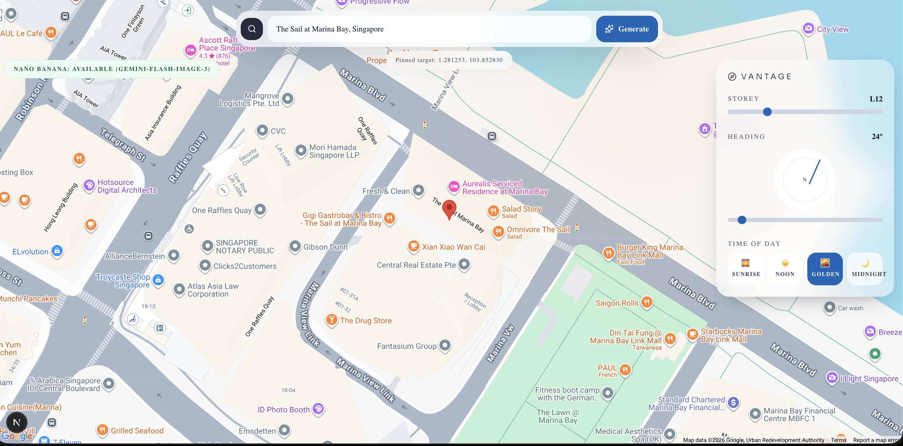
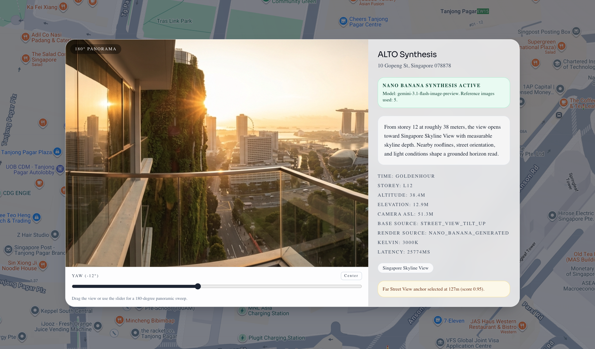
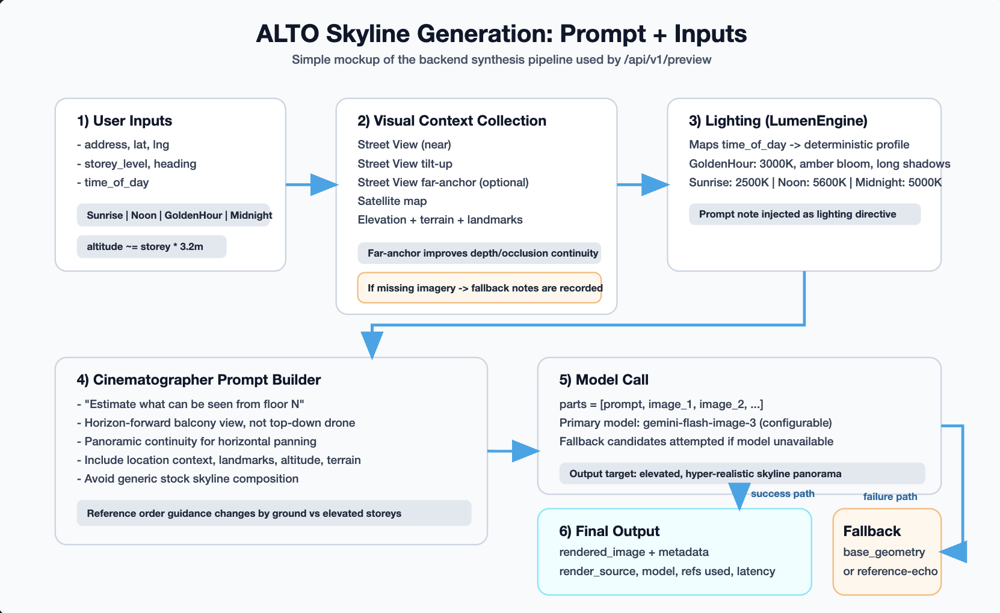
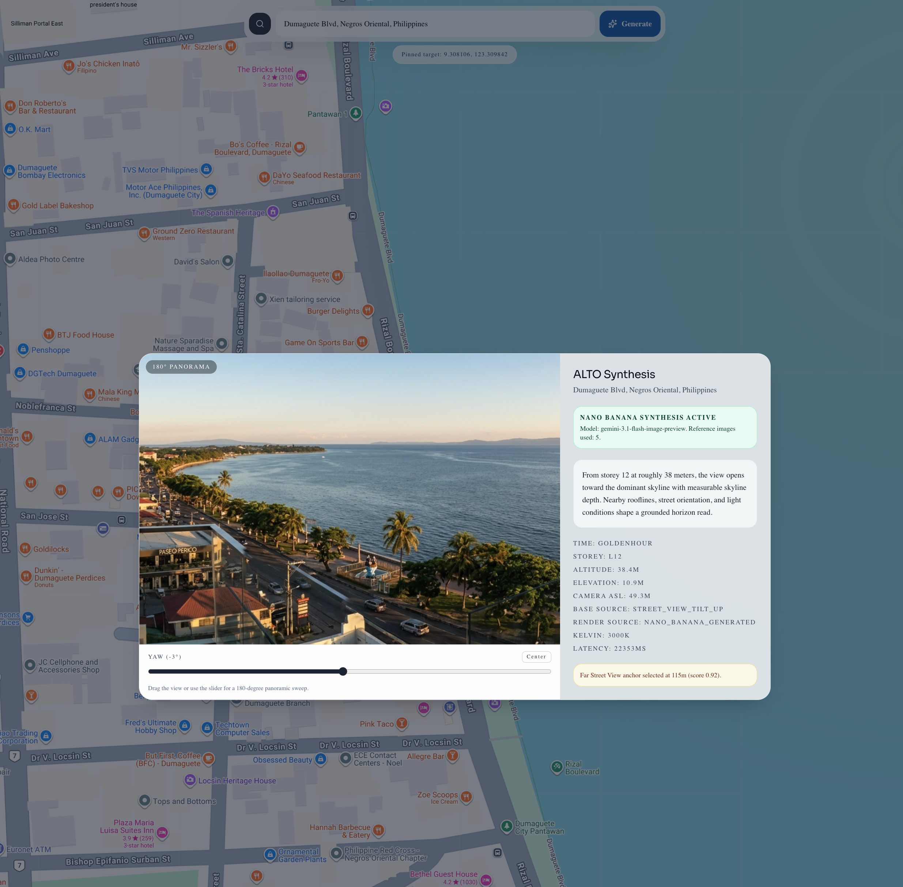

# ALTO: Generating Skyline Views Before They Exist

For the SG DeepMind Hackathon, I built ALTO, a skyline visualization and synthesis platform for real estate and urban planning.

The idea started from a simple question: before you visit an apartment, book a hotel room, or evaluate a site, can you understand what the view will actually feel like from a specific floor, direction, and time of day?

Most property tools stop at maps, photos, and floor plans. Those are useful, but they do not answer the question people often care about most: "What will I see from here?"

ALTO tries to answer that by combining maps, Street View, satellite imagery, location context, lighting rules, and generative AI into a single preview workflow.



## What ALTO Does

The app lets a user enter an address, choose a storey level, set a viewing direction, and select a time of day such as sunrise, noon, golden hour, or midnight.

From there, ALTO generates an elevated skyline preview and a short narrative explaining the view. It also returns useful metadata: approximate altitude, nearby landmarks, elevation, lighting profile, render source, latency, and whether the system had to fall back to a base geometry image.

The frontend is intentionally simple: a map-first interface with controls for vantage point and direction. The heavy lifting happens in the backend.



## The Architecture

ALTO is structured as a small monorepo:

- `frontend/`: a Next.js App Router experience with Tailwind and Google Maps
- `backend/`: a FastAPI service that orchestrates Google Maps data, lighting logic, and Gemini image/text generation

The core endpoint is:

```http
POST /api/v1/preview
```

A request includes the address, latitude, longitude, storey level, camera heading, and time of day. The backend turns those inputs into a visual context package.

At a high level, the pipeline looks like this:

1. Resolve the location and nearby context.
2. Fetch visual references from Google Maps: Street View, tilt-up Street View, satellite imagery, and a fallback geometry image.
3. For elevated floors, probe for a farther Street View anchor to help the model reason about skyline depth.
4. Convert storey level into approximate altitude.
5. Generate a deterministic lighting profile with the `LumenEngine`.
6. Send the prompt plus reference images to the image model.
7. Generate a short skyline narrative alongside the render.
8. Return the image, metadata, fallbacks, and context notes to the frontend.



## The Interesting Technical Bit

The hardest part was not "calling an image model." It was giving the model the right visual evidence.

If you only send a prompt like "show me the view from floor 18," the output can look polished but generic. It may invent landmarks, flatten the perspective, or produce a skyline that feels disconnected from the actual location.

ALTO builds a reference stack instead:

- near Street View for immediate street-level geometry
- tilt-up Street View for facade and vertical cues
- satellite imagery for orientation and urban layout
- optional far-anchor Street View for depth on elevated floors
- base geometry as a fallback

The prompt then tells the model how to interpret those references: infer the uplift from the selected floor, preserve the heading, keep the view horizon-forward, and avoid unsupported landmarks.

That made the system feel more like a visual synthesis tool and less like a generic image generator.

## Lighting With LumenEngine

I also added a small deterministic lighting layer called `LumenEngine`.

Instead of letting the model interpret "golden hour" or "midnight" loosely every time, the backend maps time of day to structured lighting profiles. For example, golden hour uses warmer color temperature, stronger bloom, amber cast, and longer shadows. Noon uses more neutral overhead light. Midnight uses point-light behavior and night-scene grain.

This is deliberately simple, but it gives the system a more stable creative direction.



## Where This Could Go

ALTO started as a hackathon prototype, but the use cases are surprisingly broad:

- real estate previews for apartments, condos, offices, and hotels
- pre-construction marketing for units that cannot be visited yet
- site evaluation for developers and brokers
- tourism and hospitality previews for room views
- urban planning and public consultation
- insurance, risk, or environmental assessment where visibility and terrain matter
- consumer tools for comparing units by view quality, not just price and square footage

I can also imagine a future version where ALTO compares multiple units, estimates obstruction risk from future developments, or generates seasonal and weather-aware views.

## What I Learned

The project reminded me that generative AI is most useful when it is grounded. The model is powerful, but the product quality comes from the surrounding system: the input structure, reference ordering, metadata, fallbacks, and UI constraints.

For me, ALTO was less about making a pretty skyline and more about building a small visual reasoning pipeline around one very human question:

What would it feel like to stand here and look out?

GitHub: [andrewnyu/alto](https://github.com/andrewnyu/alto)

## Medium Image Notes

Medium may not preserve local Markdown image paths when pasted directly. The easiest workflow is:

1. Open the images from `usage-images/`.
2. Upload each image manually into Medium at the matching point in the article.
3. Use the flow diagram after "The Architecture."
4. Use `mapping-view.png` near the beginning to show the product interface.
5. Use the generated skyline examples to break up the technical sections.

Suggested cover image: `usage-images/icon-gopeng-view.png`
